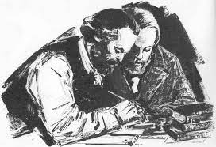

\newpage

## [Theses On Feuerbach](https://www.marxists.org/archive/marx/works/1845/theses/theses.htm)

---

>**"The philosophers have only interpreted the world, in various ways; the point is to change it." -Karl Marx**

---

> ### Kecacatan utama dari semua materialisme terdahulu (termasuk materialismenya Feuerbach) adalah bahwa hal-ihwal [Gegenstand], realitas, keindrawian, dipahami hanya dalam bentuk objek, atau kontemplasi, namun bukan sebagai aktivitas indrawi manusia, praktik, bukan secara subjektif. Maka dari itu, bertentangan dengan materialisme, sisi aktifnya dijelaskan secara abstrak oleh idealisme – yang, tentu saja, tidak mengenal aktivitas indrawi yang nyata. Feuerbach mengehendaki objek-objek indrawi, yang sungguh dibedakan dari objek-objek konseptual, tetapi dia tidak memahami aktivitas manusia itu sendiri sebagai aktivitas objektif. Dalam Das Wesen des Christenthums, dia oleh karenanya memandang sikap teoretis sebagai satu-satunya sikap manusia yang sejati, sementara praktik dipahami dan dimaknai hanya dalam bentuk penampilannya yang kotor. Oleh karenanya, dia tidak menangkap signifikansi dari aktivitas “revolusioner”, dari aktivitas “praktis-kritis”

- Marx menegaskan kekurangan materialisme sebelumnya, walau sudah dalam jalan yang tepat dengan mensupremasikan manusia sebagai penentu nasib, tetapi tetap jatuh pada kesalahan idealisme dalam mencoba untuk mejelaskan aktivitas manusia hanya sebagai konseptual abstrak yang tidak menjelaskan secara objektif aktivitas manusia.
- Hal ini tidak memenuhi tugas yang "praktis" karena tetap jatuh pada abstraksinya idealisme, dan maka itu dibilang oleh marx sebagai sebuah kecacatan yang belum memenuhi kebutuhan material era industri dan saintifik.

> ### Pertanyaan apakah kebenaran objektif dapat dikaitkan dengan pemikiran manusia bukanlah pertanyaan teori, tetapi merupakan pertanyaan praktis. Manusia harus membuktikan kebenaran - yaitu realitas dan kekuatan, sisi ini dari pemikirannya dalam praktik. Perselisihan tentang realitas atau non-realitas pemikiran yang terisolasi dari praktik adalah pertanyaan skolastik

- Pertanyaan "bagaimana kita bisa mengetahui apapun itu benar" dalam filosofi adalah pertanyaan yang tidak berguna jika hanya dipikirkan dalam model abstrak.
- Marx berargumen bahwa kebenaran objektif adalah pertanyaan praktik dan material, dimana hanya manusia melalui realita material dunia yang bisa menentukan apakah suatu hal itu benar atau tidak secara objektik.

> ### 
