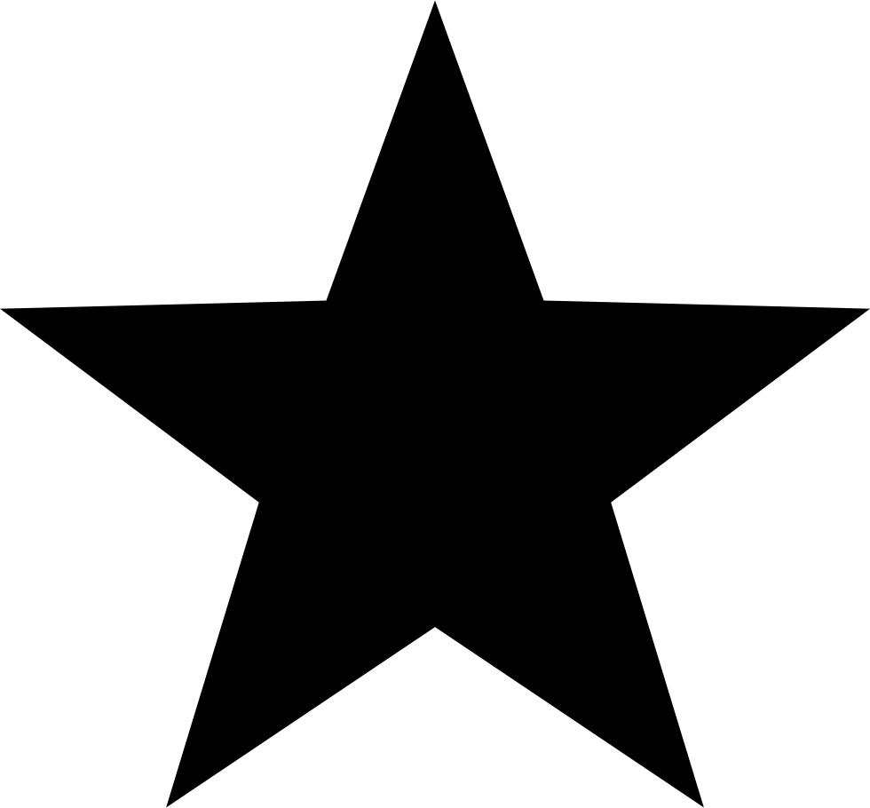

\newpage

## The Theory of Knowledge (Epistemology)

---

### Can We Really Understand the World?  

*This is an essay I wrote in 1989 for folks in a physics discussion group I was part of for a while—until I got sick and had to drop out. It was led by Steve Bryson as an adjunct to a short course on particle physics he was teaching at the California Academy of Sciences. The one section on “representation” is—strictly speaking—about an issue in aesthetics, but it is tied in here with the question of whether scientific theories can be truly said to represent the actual physical world.*

I think that most of us in our physics discussion group have been delighted and enthusiastic about how things have been going so far. One of the main reasons why the discussions have been so lively, I think, is that Steve Bryson has selected some very provocative—that is to say thought provoking—questions for us to focus on. At the second session, for example, he raised a number of good questions which I have paraphrased as follows:

What is the relation between our opinion, or views, of the world, and the way the world actually is?
Could the world be such that we might not be able to imagine or understand how it actually works?
Aren’t we severely handicapped by the limited concepts and words which we have available in our language? What if this limited stock of concepts is inadequate for the construction of theories that accurately describe the world?
What is representation? What is the relation between something “real”, and a representation of it (such as a painting)? What makes a painting a painting of a rose, for example?
What is a field? (In physics.)
What is a particle? (What various concepts of ‘particle’ do we have?)
I find that these sorts of questions challenge me to work out and clarify my own ideas. In this essay, I’d like to discuss the first four topics above.

What is the relation between our opinion, or views, of the world, and the way the world actually is?
This is no doubt one of the most fundamental questions in all of science. To ask it is in fact almost to pose the question which gave rise to the great split between the materialist and idealist world views.

The answer to this question, from the materialist perspective, is that our ideas, or opinions, or views of the world are reflections of the world; that is, they derive from the world and the ways we interact with it. The world exists, matter exists, and we gradually come to know it better because we interact with it in more sophisticated ways. Our experiences, our form of life, the way we exist—and of course the conscious scientific experiments we perform—all go into determining our views. As these experiences and forms of existence develop, and as we (speaking collectively!) perform new experiments, our ideas of the world progress, and (generally) get closer to the truth.

How do we know we are always getting closer to the truth (even if we can never actually arrive at it completely)? Because we can do things now that we could not do before. Our degree of control over the world is increasing. We can make iron tools, build radios, and go to the moon; with our older ideas we could not do these things.

Even the most primitive, “pre-scientific”, views are still a reflection of the world, or at least were originally. At one time (thousands of years ago!) the idea that lightning bolts were the creations of powerful beings in the sky was a reasonable hypothesis. It may well have been the only theory anybody could think of back then. As crude as this theory was, it at least based itself on people’s experience that we have some control over nature, that we can pick up a rock and throw it for example, and that likewise the rest of nature might be under somebody’s control in a similar fashion. (I.e., it was an analogy based on people’s experiences.) It at least implied that things like lightning are not completely inexplicable, but are things which can be caused somehow.

[Aside: The argument has been made that the primary way we come to understand anything is through analogy. As Marvin Minsky remarked: “How do we ever understand anything? Almost always, I think, by using one or another kind of analogy—that is, by representing each new thing as though it resembles something we already know.”[1] Logicians, being mathematicians, or mathematically inclined, tend to greatly overestimate the role of formal logic in our thinking. Furthermore, they tend to imagine that all types of thinking are either deduction or induction. The concept of ‘induction’ is a somewhat misguided attempt to formalize one type of thinking-by-analogy into something like a “deductive” argument. (I.e., the attempt amounts to drawing an analogy—albeit a basically misleading one—between one kind of reasoning-by-analogy and reasoning-by-deduction!)]

The reason why people today with a smattering of scientific knowledge (like me!) can justifiably laugh at the idea of Zeus hurling thunderbolts, and the sun being a bonfire dragged across the sky behind a chariot, is that now we have better theories. It is not so much that the older theories were “foolish”; it is that they now look foolish in comparison with our better theories which are more coherent, of broader explanatory power, better tested, etc. Even our best current theories will also look somewhat foolish (at least around the edges) in the future.

I have been speaking as if all of humanity had the same, collective, view of the world. Of course that’s not true. There are those whose views have scarcely advanced beyond that of a god in the sky hurling thunderbolts. And it is quite justifiable to speak of those whose views have not kept up with the march of science (at least in the main) as “unscientific”. At one time you could be scientific and believe in the phlogiston theory; that is no longer possible.

Even within the “scientific community” there is a wide and diverse range of views deriving from all sorts of social influences. You will find Nobel prize winning physicists who hold the most scientifically untenable and discredited views about the supposed lower intelligence of Blacks versus whites. You will find some scientists championing creationism, and arguing that the world was created just a few thousand years ago, despite the conclusive scientific case against such nonsense.

It has been a long time since it was possible for any one person to have a complete and fully up-to-date scientific view of the world, because science has grown far too large. Because of the backwardness of society, and our miserable excuse for an education system, it is now actually fairly common to find even scientists whose acquaintance with science scarcely goes beyond their own specialty (if that!), and who hold the most unscientific (i.e., laughably obsolete) views in other areas. I know one medical scientist, for example, who believes in shamanism, Tarot card reading, and many similar “New-Age” things.

It is possible, however, for someone to have a basic scientific view of the world, to have some familiarity with the basic current theories and findings in each of the major sciences, and to approach things in general in a scientific way. Certainly a goal to strive for!

Could the world be such that we might not be able to imagine or understand how it actually works?
We need to separate this question into several versions, some weaker, some stronger:

Is the world such that some aspects of it are initially beyond what we can imagine or understand?
Well, yes of course. We have to work at understanding the world, and understanding comes in some areas before it does in others. Some aspects of the world cannot be imagined or understood until certain prerequisite aspects are understood. Democritus could imagine a crude theory of atoms, but there is no way he could have imagined quantum chromodynamics.

Is the world such that every aspect of it is initially beyond what we can imagine or understand?
Nope, can’t be. If that were true, we never could have come to understand anything; science could not have gotten started. Even the most primitive human beings were capable of understanding some aspects of the world. To survive, each creature in the world must be capable of interacting with it with some degree of success. And each conscious creature, in recognizing what it must do to survive, thereby must recognize some truths—even if only partial and one-sided—about the world.

Is the world such that some aspects of it are forever beyond what human beings can imagine or understand?
We don’t know yet, and maybe we will never know. In the sense implied in the question, though, I doubt it very much. There is no reason at present to believe that human intelligence is inadequate to the job of understanding nature, at least in its central and basic aspects.

From a theoretical perspective, the only limits I can see are not due to any possible “failure of the imagination”, but rather due to the inherent limitations of any computer, no matter how sophisticated, including the human brain. Computer scientists have described problems which are inherently so complex and computationally intensive that even if every proton in the known universe could be turned into a computer as fast as our fastest Cray supercomputers, and all of them could be made to work together in parallel on the problem, there still would not have been enough time in the 15 billion years since the “Big Bang” to find the solution. But! This is only relevant if it can be shown that understanding some aspect of the way the world works requires us to solve such monstrosities, and so far nobody has come up with any reason to believe this.

Although modern physics is certainly complicated, it would have to be more complicated by many, many orders of magnitude before it exceeded the capacity of the human brain to understand.

Is the world such that some aspects of it are forever beyond what any conceivable intelligence can imagine or understand?
Possibly, and for the same reasons as above. But, again, there is at present no reason to believe this.

Someday, if we do not destroy ourselves first, human beings will build what has been called ultra-intelligent machines, i.e., computers that are more intelligent than we are. We will then proceed to connect ourselves up to these UIM’s in more and more intimate ways, so that we can interact with them (via radio transmitters in our skulls, perhaps). It’s my guess that Homo sapiens and the intelligent machines it constructs will eventually merge into a new species of being, and continue evolving in a completely new way (i.e., by self-redesign, instead of through natural selection). Either that, or our more intelligent creations will simply replace us. In either case, the capacity for every kind of intelligence will continually expand in such creatures.

If we do someday reach a level of understanding of the world where we cannot go further or deeper because of the constraints of the computational capacity of our brains/computers, then we will have the option of expanding that computation capacity. Only if the universe turns out to be so complex that no reasonable subset of it can be organized to model the essential features of the whole, will the whole scientific enterprise be ultimately stymied. And there is no reason to believe that this is the case.

Aren’t we severely handicapped by the limited concepts and words which we have available in our language? What if this limited stock of concepts is inadequate for the construction of theories that accurately describe the world?
This is a pseudo-problem. We are constantly finding ourselves in need of new words and concepts, not only in our attempts to understand and describe the world, but in all our pursuits. When we need a new word or concept, we just invent it. (Or at least the more clever amongst us do, and the rest of us proceed to make use of their inventions.)

Remember, at one time not one single word or concept we have today existed! (At one time even people did not exist; at one time the earth did not exist.) So where did all these diverse concepts come from? We invented them. No big deal.

Any species capable of inventing all the concepts we have invented so far is capable of inventing a lot more. We invent them as we need them, and there is absolutely no reason to think that our inventiveness in this area will ever fail us.

Our experience in interacting with the world is the primary source of our ideas and concepts about the world. And as long as any aspect of the world can be experienced by us, no matter how vicariously, then we can formulate concepts to describe and understand that experience. (If one supposes that there might be “aspects of the world” that are beyond any possibility of experience, then an explanation is needed as to why such a thing is considered an “aspect of the world” in the first place, and not simply a fantasy.)

Of course it is true that certain new concepts we come up with may at first appear quite strange, or even bizarre. But if these concepts are vital, and coherent in terms of our broader theories and knowledge, we will eventually get used to them. (Or at least new generations will.)

The recent history of physics shows there is plenty of imagination at our collective disposal. In fact a case could be made that the problem is frequently in the other direction, that we let our imaginations run too wild. (You may wish to consider my speculations about the merger of human beings and UIM’s, discussed above, as a good example of this in another sphere!) Perhaps what really needs to be done is to focus a bigger share of our imaginative power into designing experimental tests for the theories and concepts that our unbridled imaginations are always cooking up.

What is representation? What is the relation between something “real”, and a representation of it (such as a painting)? What makes a painting a painting of a rose, for example?
This is primarily a question of interest in aesthetics, where in fact it has been considerably discussed.[2] In my opinion the basic answer to the question is that A is a representation of B if and only if

A is in some respects (especially visually) a copy or imitation of B;
A is sufficiently similar to B in relevant aspects; and
A is also sufficiently dissimilar to B, in relevant respects, so that A and B are not things of precisely the same kind.
The point of item number 1 is that representations are (typically anyway) visual imitations of some original. The point of item 2 is that there must be a number of important characteristics or aspects of the original that the representation shares (or has an analog for), in a kind of one-to-one correspondence, but that it is impossible to say in the abstract how many such correspondences there must be, or to say in the abstract precisely which corresponding elements are relevant and which are not. (The fact that my painting of an apple and the apple itself both weigh 6 oz., and the fact that they are both sitting on the same shelf, may be true, but are completely irrelevant to my painting being a representation of the apple. These are non-visual aspects; but some visual aspects of the painting may also be irrelevant to its being a representation of an apple.) And the reason for item 3 is that a coke bottle is not a representation of a coke bottle precisely because it is itself a coke bottle.

So, I would say that a painting is a painting of a rose if it is a certain kind of representation of a rose, that is, if there are a sufficient number of relevant aspects of the painting that correspond to aspects of the rose. The things that would count as relevant here are presumably various aspects or features of shape and/or coloration, and their interrelationships.

Well, aesthetics is fun, but what is the relevance of all this to physics? I think that Steve brought this topic up because he wanted to raise some questions about how true any of our scientific models (theories) of the world really are. That is, I think he was trying to suggest that scientific representations of real world entities or phenomena might have little or nothing to do with the way these things actually are. I think he was basing this view on an analogy with aesthetics, where I suspect he takes the view that representation is a matter of the “intent” of the representor only.

Let’s put aside the question of whether Steve actually holds these views (I could be wrong in my suppositions!), and just consider these views themselves, and their implications.

The idea that representation is just a matter of the intent of the person doing the representing is a subjectivist view. It starts from the fact that there are lots of different ways of representing a rose in a painting and jumps to the conclusion that anything in a painting might be a representation of a rose if that is what the painter intended. “Let this black X represent a rose...”

This is a view that deserves extensive criticism, but obviously the place to do it is in a paper on aesthetics, not a paper on physics. Let me just say that I think this view is essentially wrong—though like most wrong views, it has a small element of truth to it. One of the reasons why it sounds as plausible as it does is that it rests on a confusion of the different standards that exist for what counts as a representation within different artistic styles or genres.

In a realistic style, for example, the standards of representation are much stricter that they are in an abstract style of painting. Specifically, a black X is definitely not a representation of a rose in a realistic painting, no matter what the artist intended. At most it might be a symbol of a rose, which is something else.

On the other hand, it is conceivable that a swishy black X might be a representation of a black rose in a painting done in some very abstract style, where the form of objects is nearly abstracted away, and only the colors count, let us say. But even in the most abstract style, if a rose is really to be represented in a work, there must be something about the representation that mirrors the reality.

Thus the view that there need be nothing objective in any representation is wrong. There are subjective elements, both in that the standards of representation can be variously selected, and in that the specific aspects or elements that are mirrored can be variously selected. But those aspects which do get mirrored constitute the objective elements of the representation. The existence of such objective elements is essential to the very concept of representation.

Since representation is not the totally subjective animal that it is often supposed to be, the attempt to show that scientific theories or models are also totally subjective—because they are analogous to representations—also fails.

It is true that there are subjective elements in our scientific theories. That is because we do not fully understand the world. Our views and theories are partial, one-sided, even “half-baked”. But there are also some elements of truth in our theories, some objective elements that mirror the real world. We know this, because our theories can be put to practical use, to change and control the world for our benefit.

The phenomenalistic, or subjective side is there, but so is the objective side. A dialectical appreciation of both of these sides of our knowledge is necessary.

—Scott H.
   3/20/89

### Do We Know For Certain that the Earth Goes Around the Sun?

*This is an essay I wrote for some friends. We have a little group that gets together once in a while to discuss science books we've read.*

1.Introduction. Once again the question of whether we can ever be said to know anything for certain has come up in our science discussion group. Some notions never die; they can't die as long as we live in a milieu that continually fosters them. And the notion that "nothing can be known for certain" is certainly one of these.

It is ironic that I find I have to defend the view that we do know many things, and indeed that we know some things for certain—because I am probably the most skeptical person in the whole group! But as I will try to show below, there are also irrational forms of skepticism, such as "doubting everything". And actually there is a hidden unity in the thinking of many who claim (on the one hand) to "doubt everything to some degree", and yet who also strongly believe in many irrational things. The central problem is that such people do not have any scientific standards of belief and knowledge, and therefore tend to go wrong in both directions.

2.What is Knowledge? What is knowledge anyway? What is the definition of the term? Is the definition such that nothing can possibly be said to really be knowledge? (If so, why would we have such a term?)

Actually, knowledge is a fairly simple concept. Here is the complete definition from one of the better short dictionaries currently available (Merriam-Webster's Collegiate Dictionary, 10th ed.), omitting only obsolete and archaic meanings (such as "knowing someone" in the Biblical sense!):

knowledge   2 a (1) : the fact or condition of knowing something with familiarity gained through experience or association   (2) : acquaintance with or understanding of a science, art, or technique   b (1) : the fact or condition of being aware of something   (2) : the range of one's information or understanding (answered to the best of my ~)   c : the circumstance or condition of having information or of being learned (a man of unusual ~)   4 a : the sum of what is known : the body of truth, information, and principles acquired by mankind

Now none of that is very frightening or impossible to achieve. As the dictionary adds (in its discussion of various synonyms), knowledge is just the "facts or ideas acquired by study, investigation, observation, or experience." All (normal) human beings have acquired vast amounts of knowledge, and there is nothing really extremely demanding about doing so.

Philosophers, however, have tried to deepen this definition. They have generally agreed that knowledge is (approximately) "justified true belief". In other words, you can be said to know something if three conditions hold.

1. You believe it.
2. You are justified in believing it. (E.g., you have good evidence or reasons.)
3. It is actually true.

(I should note that there is an enormous amount of discussion about this definition in the philosophical literature. The reason is that this definition can be quibbled with ad infinitum. It is possible to cook up exotic examples where the three conditions hold and yet there may be some possible debate about whether the person can be truly said to know the thing, and other exceptional cases where you might possibly be said to know something even though all three conditions may not quite hold. But despite all this quibbling, I think it is fair to say that "justified true belief" is an excellent capsule definition of 'knowledge'. If it is not always precisely correct in every single case, it is very nearly so.)

But this philosopher's definition is funny in one way. Here is the way philosophers typically present the difficulty that now arises: It is generally easy to determine if someone believes something to be true, and usually it can also be easily determined if they have good reasons for believing it. But how do you go about demonstrating the third condition—determining for certain that something is actually true? It is important to do this because if it turns out that the belief is actually false we are then forced to say that the person did not really "know it" after all, regardless of how good their reasons were.

Ah, philosophers! Did you notice the intellectual sleight of hand that went on in the last paragraph? They start off talking about what it means to know something, but surreptitiously slip into talking about how you know for certain that somebody knows something. That's very different! I believe that one of the reasons this sort of thing happens is that 20th century Anglo-American philosophy has been obsessed with formal logic, and constantly tries to reformulate every problem in terms of it. They are not happy unless they can establish everything with "logical certainty". (This fixation derives partly from Russell & Whitehead's Principia Mathematica.)

Truth, in particular, is a concept that many philosophers seem to believe "belongs" to logic. Or they at least believe that truth must be discussed from the point of view of formal logic. (Actually the concept of truth is prior to any system of logic; i.e., that there are such things as true statements is a given, a prerequisite, for the construction of any system of formal logic.) 'Truth' is in truth no great mystery, despite the pseudo-profundity of all the Pontius Pilate-like bourgeois philosophers of the world. (As Paul Ziff put it: "Pontius Pilate asked 'What is truth?' but would not stay for an answer.") Truth is simply (as the dictionary says) "the state of being the case".

It is very often quite easy to determine if something is true. Is it true that the book is on the table? Just turn your head and see.

But I want to return to and reemphasize the point that philosophers unconsciously seek to force simple matters of knowing into stricter matters of knowing for certain. And not just philosophers, but also other people, and especially scientists and other intellectuals, who have been influenced (far more than they realize) by the prevailing philosophy. And knowing for certain is in turn always pushed toward the impossible standard of it being inconceivable that you could turn out to be wrong. No matter what the standard of knowledge, it is not good enough for some people. If there is even the remotest possibility that you might turn out to be wrong, then they want to say that you do not really know the thing for a fact, or at least that you do not know it for certain.

In short, such people will accept only the strictest conceivable standards for knowledge, and that is ridiculous. Actually we have a whole series of standards for knowledge, standards that become stricter by degree, and we have words and phrases to indicate which of these various standards is being applied. It is incorrect to misuse these words and phrases by demanding stricter standards than are appropriate to them.

3.Standards of Knowledge. To judge anything whatsoever you must have standards; standards appropriate to that particular sort of judgment. Thus at a dog show there are certain types of standards the judges use, and even there, the standards used to judge dachshunds are not necessarily those used to judge St. Bernards. Short legs, for example, are a virtue in dachshunds, but a negative characteristic in St. Bernards. Moreover, when you categorize a dog as a dachshund you are able to do so by (at least implicitly) referring to those very same standards. To categorize is to implicitly judge in light of certain standards.

We all categorize our various kinds of beliefs and knowledge too. Any time you categorize some assertion as a "fact", or as "something we know", or as "something that is certainly true", or as something which is "beyond all doubt", you are judging it according to a set of implicit standards of knowledge. And those standards vary somewhat according to the precise phrase used. Another way of putting it is to say that these qualifying phrases exist for no other reason than to indicate which sorts of standards are appropriate in the given case.

Let's look at some of the ways in which we categorize knowledge. Let X be any statement, such as: "The earth goes around the sun." or "No human beings are presently living on Mars."

1. X. (I.e., simply stating that "The earth goes around the sun.", etc.)
2. It is a fact that X.
3. We know that X.
4. We know for sure that X.
5. We know for certain that X.
6. We know, beyond any reasonable possibility of error, that X.
7. We know with scientific certainty that X.
8. It is absolutely certain that X.
9. We know as well as we know anything that X.
10. We know, beyond any possibility of error whatsoever, that X.
11. It is logically certain that X.
12. It is impossible to conceive that X is false. (Or, it is impossible to conceive that X might turn out to be false.)

Our most usual method of reporting something that is known is 1. Methods 2 and 3 are used when it is desired to emphasized that X is known, and is not just someone's belief.

The standards of knowledge implicit in the first three variations are more or less the same, and are just those which we use for scientific knowledge in general, as well as every-day knowledge (such as that my name is Scott, I live in California, etc.) These are tough standards, and there are many things that are probably true, things for which we have some good reasons for believing, but which are not known to be true. (That there is no life on Jupiter, for example, or that I will never win the lottery.) But the remaining variations imply standards which are even tougher, and which get progressively tougher as we go down the list.

The standard implicit at level 4 and 5, for example, says that this is not just run-of-the-mill, average knowledge we are talking about, but something for which we have exceptionally good, or overwhelming evidence. If knowledge is "justified true belief", then "certain knowledge" is exceptionally well justified true belief. It is a plain and simple fact that the evidence we have for some of the things we know is much greater than the evidence we have in other cases. We do know for certain that the earth goes around the sun, and to express it this way is just to emphasize that our reasons for believing this are indeed extremely or exceptionally good. To deny that we know for certain that the earth goes around the sun is thus to deny that our evidence for this is anything beyond the ordinary, and that would be incorrect. To say that we do not know for certain that the earth goes around the sun is to suggest—quite falsely—that there is some reasonable doubt about it.

The standard implicit at level 6 and 7 is a bit stricter yet, but when you start using the word 'absolute' (level 8) there is a qualitative jump. The standard implied at 8 and 9 is one of virtual impossibility of any error. Another way to look at it is: What else would we need to throw out if it turns out we are wrong about this belief? If it were to really turn out that the earth does not go around the sun, then we would have to throw out a very large part of what we know about astronomy and science in general. Once you get to the point where the alternative is throwing out just about everything science thinks it knows, it is more than justified to say that we know the thing with absolute certainty. Therefore I have no qualms at all in saying that it is absolutely certain that the earth goes around the sun. There really is no (scientific) doubt about it whatsoever.

At level 11 the standard explicitly indicated is that of formal logic. This is indeed a very high standard, but it is usually not applicable. It is not applicable to the case of the earth going around the sun for example, since there is no logical contradiction either way. However, we can know with logical certainty that the Christian God does not exist, since he is supposed to be all-knowing, all-powerful, and all-good, which logically precludes the existence of evil (which certainly does exist).

By the time you get to 12 the standard is so ridiculously high that nothing can possibly meet it (Descartes notwithstanding). A standard that cannot possibly be met is a pretty much useless standard, and that is why you seldom even hear it (except in philosophy classes!). But please note that the standard at 12 is not the same as the standard at 4 or 5. Lots of goofy things are conceivable! It is conceivable that I might really be just a brain in a vat somewhere, hooked up to a powerful computer that stimulates my nerves (optic, tactile, etc.) in such a way that I seem to see and feel things which are not in fact there. Perhaps in this scenario the earth and sun never even existed; my brain and vat might be in a different galaxy. But as I say, this absurd standard is almost never appropriate, and except in science fiction and philosophy class it should be totally rejected as a reasonable standard of knowledge.

In summary, we must not use or imply standards of knowledge that are ridiculously inappropriate.

4.Contemporary Science and Philosophy. Many people are unaware of how much science and philosophy influence each other. Scientists generally try to interpret their new discoveries and theories in terms of the prevailing philosophies. (In a bourgeois world, this almost always means in terms of bourgeois philosophies.) Philosophers, in turn, show great interest in major new scientific theories, especially physical theories, whether it be Newtonian physics, relativity theory, quantum mechanics, multi-dimensional string theory, or whatever, and build new philosophical world outlooks inspired in part by such theories. Quite often these scientists and philosophers are in fact the same group of people. Niels Bohr was more of a philosopher of science than he was a physicist (even though he was a much better physicist than he was a philosopher!)

Moreover, there is a very strong bandwagon effect in science and philosophy (as in intellectual circles in general). Over the past century many scientists, and especially physicists, have followed behind the faddish currents in bourgeois philosophy like little puppies. At the beginning of the 20th century the dominant philosophical outlook among scientists was a kind of naive materialism, corrupted however by the frequent incompatible assumption that God exists, or may exist. With the advent of relativity theory and quantum mechanics, materialism of any kind (naive or otherwise) was thrown out, and various forms of idealism became practically mandatory in the scientific community. During the 1930s physicists flocked towards logical positivism and the Vienna Circle. This extreme form of empiricism was pretty crude however, and so they soon shifted into the variation of that school developed by Karl Popper. More recently even Popperian positivism has been losing ground to more blatant forms of idealism, such as the religious physics championed by Steven Hawking, Roger Penrose, Paul Davies, and the notorious Frank Tipler.

But despite the inroads of openly religious ideas into contemporary physics, the fundamental outlook characterizing the field is still basically that of Karl Popper. And one of the main tenets of that worldview is a doctrinaire philosophical agnosticism.

(One of Popper's central dogmas is that you can never prove any theory to be correct or know that it is true, but you can disprove theories by finding facts incompatible with them. This is itself a theory, and one of the many problems with it is that it applies to itself! That is, this doctrine of falsification is a theory that Popper puts forward as being true even though the theory itself says that you can never show any theory to be true. A more basic problem with it is that it fails to recognize that facts are only facts in terms of a theory. (Or, putting it another way, there is no hard line between a fact and a theory.) Therefore to adduce "facts" which falsify one theory is really to implicitly apply another theory; but how do you know that theory is true? Moreover, this falsification doctrine is unidimensional, neglecting many other characteristics a scientific theory must possess—such as internal coherence and compatibility with other (especially broader) theories. In short, Popper's falsification theory is quite wrong. Even most bourgeois philosophers have rejected it as simplistic at best, but in the sciences (especially physics) it is generally accepted as gospel. You may take it as a given: scientists are always bad philosophers.)

5.Philosophical Agnosticism. The term 'agnosticism' in ordinary speech usually means doubt about the existence of God, or (more strongly), the view that no one can know whether or not God exists. Philosophical (or epistemological) agnosticism is a generalization of that view to all of knowledge: it is the theory that no one can ever really know anything, or at least that no one can know anything for certain. Why? Because it is conceivable that you might turn out to be wrong! (That's right, the silly argument I already discussed and rejected earlier—rejecting it because it unreasonably demands an inappropriate and impossible standard for knowledge.)

Quite bizarrely, but under the influence of Popper, many people—including a great many scientists themselves—imagine that philosophical agnosticism is the fundamental assumption of modern science. Although everyone would agree that there is an enormous amount of evidence for some scientific beliefs, and that there is a lot more evidence for some beliefs than for others, they still want to say that you can never have enough evidence that you are justified in saying that you know the thing for sure. In fact many people are so much under the influence of this view that not only do they reject any claims that we know some things for certain, they are even quite uncomfortable with claims that we know anything period.

"We live in an age of uncertainty..." How many times have you heard that?! And yet more is known now than ever before. Scientific knowledge is increasing at a very rapid pace. So why is it that people lean so strongly towards agnosticism in the present age, of all times?! As I already mentioned, in part this is due to 20th century developments in physics that have forced people to admit that some important things they thought they knew about the world are not in fact true. But in other spheres too, the old certainties of the 19th century have faded away. The comfortable expectations of permanent peace, prosperity and steady social progress were shattered by world wars, the Great Depression and "frightening" revolutions. In the arts all sorts of "crazy" new forms have appeared, from atonal music to nonobjective painting. Traditional forms of religion have been seriously questioned and challenged, and new religions have entered the market place. With the advent of atomic weapons even the continuation of the human species can no longer be taken for granted. With all the old verities smashed, it is no wonder that bourgeois society entered a period of great self-doubt, and that agnosticism has become the dogma of the age.

But really this should all be considered rather amusing! It is like six-year-olds learning that Santa Claus doesn't exist and then refusing to believe anything at all their parents tell them. I know one little kid like this, Robin, the nephew of a friend of mine. One evening recently he asked me "Are motor cycles really dangerous?" He had been told by his parents that they are, but he didn't want to believe it, so he was checking with other "authorities"! But scientists have no authorities to turn to except the physical (and social) world itself, and must therefore stew perpetually in their own uncertainty if they are under the spell of Popper.

We sometimes do discover that something we thought we knew is wrong. But that does not mean we "really" know nothing, or that everything else we think we know might turn out to be wrong! When we discover that we are wrong about some such thing it should indeed make us a bit more skeptical, but primarily about beliefs of the same sort. That is, beliefs that are supported to the same degree. We need not become skeptical about beliefs that are supported to a much great degree, let alone beliefs that are supported by absolutely conclusive evidence.

Suppose you have an acquaintance who lies to you sometimes. When you discover this it is wise and correct to become more skeptical of what that person says in general. However, it would be unjustified to become more skeptical of everybody, since you already know that there are a few people out there who tend to lie a lot, and it is enough to recognize that this acquaintance is one of them. The increase in skepticism must be appropriate to the discovery of error on your part.

6.Scientific Skepticism. Let's look at a couple of Richard Feynman's comments on the topic of scientific certainty:

Every once in a while you read in the paper that physicists have discovered that one of their favorite laws is wrong. Is it then a mistake to say that a law is true in a region where you have not yet looked? If you will never say that a law is true in a region where you have not already looked you do not know anything. If the only laws that you find are those which you have just finished observing then you can never make any predictions. Yet the only utility of science is to go on to try to make guesses. So what we always do is to stick our necks out, and in the case of energy the most likely thing is that it is conserved in other places. [The Character of Physical Law, (Cambridge, Mass: MIT, 1995 (1985)), p. 76.]

In order to avoid simply describing experiments that have been done, we have to propose laws beyond their observed range. There is nothing wrong with that, despite the fact that it makes science uncertain. If you thought before that science was certain well, that is just an error on your part. [Ibid., p. 77.]

Is Feynman correct? Is science really completely uncertain? Is it all just a bunch of elaborate "guesses"? No, it is not. You can see why Feynman might want to say such things to people who know little of science and who imagine that science consists of a huge body of facts, all (or most) known with certainty. That is definitely not the case. But though it may be appropriate from a pedagogical point of view to emphasize the uncertainty in science, and even to suggest it is nothing but an elaborate system of "guesses", that is really quite silly if taken literally. To guess, says the dictionary, is "to form an opinion of from little or no evidence". But of course the point of science is to develop theories that are based on good evidence, and in the best cases, on overwhelming evidence. These theories in turn allow us to make scientific predictions which are not mere guesses, but for which we have good reasons, and in some cases the best possible reasons, i.e., complete certainty. When you predict that if you let go of your apple it will fall to the floor, that is not a guess, but a sure thing (provided of course there are no hidden strings, ferocious up-draughts, special electric fields, etc.).

It is incorrect to say either that "science is certain" or that "science is uncertain". There is both certainty in science and uncertainty—just as there is in everyday knowledge. Most of the accepted facts in science do have some small degree of uncertainty associated with them, as do most theories. But there are some facts and theories in science that are known with complete certainty. (There is no doubt or guesswork about them whatsoever.) No total or absolute skepticism is justified either in science or in everyday life, and to suggest otherwise is just an error on Feynman's part.

- A few of the many scientific facts and theories that are now known with complete certainty (to science, though not to every human being) are:
- The earth orbits the sun.
- The moon orbits the earth.
- The earth is (more or less) a sphere.
- The earth spins on its axis (relative to the stars).
- The earth was formed vastly longer ago than 4,004 BC.
- Water is composed of two atoms of hydrogen and one of oxygen.
- Table salt is sodium chloride (plus impurities).
- Plant and animal species on earth have evolved from earlier, simpler organisms.
- Human beings require oxygen to live.
- (Ordinary) heat is at bottom the motion of molecules.
- Some atoms are radioactive.
- Light is a form of electromagnetic radiation.
- The human organ responsible for intelligence and other mental capabilities is the brain.
- Contemporary society consists of various social classes.

We could go on and on. At one time none of these things was known at all. Furthermore, each was at one time only guess-work, only a hypothesis. Not only that, but there are undoubtedly still more that can be learned about each of these things, and the way we express these truths may even change somewhat in light of some deeper understanding. But these facts (and many others) are nevertheless now known with certainty, and science will never change its mind about these basic truths.

When Einstein put forward relativity theory we learned some new details about the precise way that the earth orbits the sun. When deuterium was discovered, our concept of hydrogen changed somewhat. When the possibility of ionization was discovered, we somewhat changed our conception of what it means to say that molecules (such as water) are composed of atoms. But even before these discoveries we still knew that the earth goes around the sun, and that water is composed of hydrogen and oxygen. Even if there are an endless series of such refinements of our knowledge (as I believe there will be), it is still quite true that we know some things for certain right now.

We will find out some more details about these basic truths, what caused them, and so forth, and perhaps the solar system will explode someday and some of them will no longer be true. But as for now, they are scientific facts, known beyond any rational doubt whatsoever to be true—definitely and certainly true.

Many other things are known with equal certainty: that human beings (as we are presently constituted) generally have two arms and two legs (I'm tempted to say that's as plain as the nose on your face); that human muscle power is insufficient for any human to jump from the earth to the moon unaided; that lightning is not caused by Zeus hurling thunderbolts! Science will never change its mind on these points! Anybody who denies that we know these things for certain has been corrupted by a screwy epistemological theory to the point where they cannot think straight on the issue any more. No total skepticism about human knowledge is ever justified.

I don't wish to condemn skepticism altogether; it is an extremely important component of the scientific outlook. In general we should be skeptical to various degrees about most scientific theories. For many of them only a small degree of skepticism and doubt is justified, and usually "just around the edges". That is, our occasional skepticism about well-established and well-tested theories should mostly be focused on issues such as wondering if the scope of the theory is really quite as broad as has been claimed. Relativity theory, for instance, requires some degree of skepticism, but especially under extreme conditions such as in the sub-atomic world, or inside black holes where it clearly breaks down.

It may even be fair to say that all broad scientific theories require some degree of skepticism—just because they are so broad. Many of the details of the theory of evolution, for instance, are still in question, and some may always be. (But that doesn't mean there is any scientific doubt about the basic fact of evolution. The basic theory of evolution is established beyond any reasonable doubt; i.e., with scientific certainty.) The same is true of Marxism, incidentally. There are many things about it which are still subject to reasonable doubt, dispute, and possible amendment. But there is a core of basic ideas (such as the existence of the class struggle, and the need for revolution) which have been established beyond any reasonable scientific doubt. (The fact that many people do not understand this or believe it, is irrelevant to science, just as with the case of the many creationists who reject evolution.)

Some theories, especially the newer, less well-developed, less well-considered, and most importantly of all, less well-tested ones, require much more skepticism. You might believe the theory, and even have considerable evidence, but you should still be somewhat skeptical. Take the Alvarezes' theory that the cretaceous extinction 65 million years ago was caused by the impact of a comet or asteroid. I believe that theory is correct, and there is more and more evidence for it. But I wouldn't say that it is conclusively proven. It could still reasonably turn out to be wrong. So some skepticism—albeit a steadily decreasing amount—is still quite justified in regard to this theory.

You don't need to be a philosophical agnostic in order to be appropriately skeptical. It is interesting that a person such as myself, who argues that we do know many things with scientific certainty, tends to be far more skeptical about many contemporary scientific theories than do those who champion philosophical agnosticism. Take the Big Bang, for instance. Virtually no cosmologist today has any real doubt about that theory. There is some important evidence for it (e.g., the 2.7° cosmic background radiation, galactic red-shifts, the ratio of hydrogen and helium to each other and to other elements, etc.). Such facts (or presumed facts) do strongly suggest an expanding universe (or region of the universe), which may be the result of a colossal explosion, the "Big Bang". But there are other explanations possible here, and the Big Bang definitely deserves a great deal of skepticism—even with respect to this basic core of it (let alone the more absurd extrapolations to 10 to the -43 seconds!). And some parts of the Big Bang theory as usually presented (by Hawking for instance) can and should be rejected as idealist nonsense, such as the notion that the universe was "created" in the Big Bang, and that neither time, nor space, nor matter, nor anything else existed before it—except God, "of course"!

Many physicists who champion epistemological agnosticism nevertheless believe quite strongly in the wildest sorts of theories. Richard Feynman for example seemed to seriously believe that there might be only one electron in the entire universe, which goes back and forth in time creating the illusion of countless trillions of electrons. Murray Gell-Mann strongly upholds the nonsensical "many-worlds" interpretation of quantum mechanics. David Mermin, a physicist at Cornell University, claimed that because of quantum mechanics (the Copenhagen Interpretation this time) "We now know that the moon is demonstrably not there when nobody looks."

What are we to think about people who claim to "know" such laughable nonsense while at the same time denying that we can know "for certain" such proven facts as that the earth goes around the sun? It seems to me that in order to smooth the path for ridiculous beliefs they need to first try to destroy people's beliefs (including their own) in things that really are known beyond any reasonable doubt.

For my part, I am very suspicious of people who say that "really" we don't know anything. Just what agenda do they have anyway? Just what alternative beliefs are they putting forward, and why?! Here is Harrison's 73rd law: People who say that everything you know is really questionable are actually trying to indoctrinate you with some new system of beliefs which you are supposed to accept unquestioningly. Some may jump on this to say that it applies to Marxists too. But Marxists have always embraced the sciences and the general body of scientific knowledge. We believe we are adding to that body by developing the science of society—Marxism. And while some individual Marxists—like any other group of people—are dogmatic about their beliefs, the main creators of Marxism (e.g., Marx, Engels, Lenin & Mao) opposed dogmatism and favored a scientific approach.

7.The Dialectical Theory of Knowledge. One of the other leading lights in contemporary bourgeois philosophy of science is Thomas Kuhn, who just died recently. His book, The Structure of Scientific Revolutions, is like the second volume of gospel (along with Popper) among scientists. One of his main arguments is that at any time we may undergo a new revolution in any branch of science which will necessitate throwing out everything we thought we knew in that area, and starting over entirely from scratch.

It just ain't so. We virtually never really go back to square one. Instead, new knowledge, including radically new theories which reorganize such knowledge, expands on and extends existing knowledge. Usually only a little bit of what we thought we knew needs to be thrown out (though they may be some key theoretical points). The picture painted by Einstein & Infeld in their classic, The Evolution of Physics (1938), is much superior to Kuhn's view:

To use a comparison, we could say that creating a new theory is not like destroying an old barn and erecting a skyscraper in its place. It is rather like climbing a mountain, gaining new and wider views, discovering unexpected connections between our starting point and its rich environment. But the point from which we started out still exists and can be seen, although it appears smaller and forms a tiny part of our broad view gained by the mastery of the obstacles on our adventurous way up.

To extend the metaphor: The progress of science consists in climbing an endless series of hills, each allowing you to see a bit further, and to connect up a wider range of phenomena. At each new peak, there are new truths which become apparent, and some old ones which need to be reinterpreted in light of the better theory. And some older ideas, which we formerly thought to be true, will now be recognized as false, or at least as seriously misleading. But despite that, there will also remain truths which are basically unaffected by the new theory, and which will never be overthrown. Thus relativity theory did not overthrow everything we thought we knew (such as that the earth goes around the sun); nor will the future corrections to relativity theory that must inevitably come along! No matter how much smarter we get, no matter how high the hill we climb, the earth still goes 'round the sun; that is a certainty!

The way we Marxists put it is this: human knowledge develops in spirals, with leaps from time to time (scientific revolutions), but never throwing out everything and starting over from scratch.

Marxism is totally opposed to philosophical agnosticism—not because Marxism is "dogmatic", but because it is scientific. Way back in 1845, in the second of his marvelously profound "Theses on Feuerbach", Marx wrote that

The question whether objective truth can be attributed to human thinking is not a question of theory but is a practical question. Man must prove the truth, i.e., the reality and power, the this-worldliness of his thinking in practice. The dispute over the reality or non-reality of thinking which isolates itself from practice is a purely scholastic question. [Marx & Engels Collected Works, vol. 5, (NY: International, 1976), p. 6.]

In short, the reason we know that our ideas about the world are correct is that our practice, our practical activity, shows we can change the world by applying these ideas. We know they are correct to the extent they actually work in practice.

In his Dialectics of Nature, Engels also discusses this issue of whether or not the world is knowable to human beings. He criticizes at length Kant and his theory that the essence of things (the ding-an-sich, or the "thing in itself") is unknowable. The non-Marxist Leszek Kolakowski sums up Engels' views on this fairly well:

On this point the new materialism [i.e., dialectical materialism—JSH] is firmly opposed to all agnostic doctrines such as, in particular, those of Hume and Kant. It rejects the idea that there is any absolute limit to knowledge, or that phenomena are radically different from unknowable 'things in themselves'. According to Engels, the agnostic viewpoint is easy to refute. Science is constantly transforming 'things in themselves' into 'things for us', as when it discovers new chemical substances that existed in nature but were not previously known. The difference is between reality known and unknown, not between the knowable and the unknowable. If we are able to apply our hypotheses in practice and use them to foretell events, this confirms that the area under observation has been truly mastered by human knowledge. Practice, experiment, and industry are the best argument against agnostics. It has indeed happened that agnosticism played a useful part in the history of philosophy, as when French scientists of the Enlightenment sought to free their own studies from religious constraint by declaring that metaphysical problems were insoluble and that science was neutral vis-á-vis religion. But even this attitude smacked of evading real problems by pretending that they could never be solved. [ Main Currents of Marxism, vol 1, (Oxford University Press, 1981), p. 393.]

It is true that Engels upheld the "relativity of knowledge", but by this he meant such things as [See Kolakowski, pp. 395-6.]:
Our knowledge is always incomplete.
New scientific laws (explanations, theories) often replace older ones. These new laws do not usually contradict the older ones, but merely narrow the scope where the old laws apply. However, we can never be completely sure that we have narrowed down the scope of the law to its "final" limits of application, or that it will never be possible to reformulate the law more precisely in the future.
Here, as usual, we see that Marxist philosophy from a hundred years ago or more is much more sophisticated and correct than the latest in bourgeois philosophy of science. Scientists could learn a lot from Marx, Engels and other Marxists, but of course they are afraid to even look because of their ideological blinders.

8.Conclusion. In saying that many things are known for certain, or that some things are known with scientific certainty, I am of course not denying that many people are very apt to be unaware of those facts. Just because it is true that there is no longer any reasonable scientific doubt about some point or other in no way prevents the scientifically ignorant from having all kinds of doubts!

There are in fact today many "belief systems" which are incompatible with some or all of science. Traditional religions and "New Age" beliefs are cases in point. Yet another is the so-called "post-modernism" viewpoint which is very influential at universities these days, and which has adopted philosophical agnosticism as one of its most central and unquestioned tenets.

Take as an example just one of these worldviews, that of the fundamentalist Christians. They say the earth was created circa 4,004 BC; but science knows for certain that the earth is very ancient (best current estimate being about 4.6 billion years old). If people are not educated in a science, or reject its findings for some reason, then they will not know what those versed in that science know—not even those things that the science has established for certain. There are many facts in Marxist theory too, such as the existence of the class struggle as the central motive force in the history of human society, that have been established beyond any rational doubt, but which most people are nevertheless either ignorant of or reject for ideological reasons. But that only goes to show that we live in a very unscientific world.

And what about my favorite example of something that we know for certain, that the earth goes around the sun? "In a random survey of more than 2,000 adults, conducted by the Public Opinion Laboratory at Northern Illinois University, 21 per cent of the respondents said they believed that the sun revolved around the earth; an additional 7 per cent said they did not know which revolved around which." [Diane F. Halpern, "The War of the Worlds: When Students' Conceptual Understanding Clashes With Their Professors'", The Chronicle of Higher Education, March 12, 1997, p. B5.]

As I love to say, we live in primitive times.

—Scott H.
   11/14/97 (with a bit more editing on 5/12/98)

#### Studying a Totally Unknown Language  \

*This is a letter I sent on Oct. 6, 2008, to my circle of friends interested in science,
together with an article from the San Francisco Chronicle. –S.H.*

Hi science fans,

The article below is about a graduate linguistics class at UC Berkeley which is studying an African language called Nzadi. There has been virtually no previous scholarly study of this language, so this class hopes to create and publish the first scientific description of Nzadi and its grammar.

The article below is about a graduate linguistics class at UC Berkeley which is studying an African language called Nzadi. There has been virtually no previous scholarly study of this language, so this class hopes to create and publish the first scientific description of Nzadi and its grammar.

But the question arises, could some outsider go the area of the Congo where Nzadi is spoken and—not having any common language with the people there—still learn Nzadi? The answer is yes, this sort of thing can be done, and has been done. If it couldn’t be done, then no one could have ever learned a language other than their own (because there would also have been no one who could have taught it to them by using their own native language as the medium of instruction).

A famous American bourgeois philosopher, W.V.O. Quine, absurdly claimed that on "logical grounds" such a thing should be impossible, but the fact is that it has been done, not only by trained linguists, but on many occasions even by travelers with no training in linguistics

Actually, I myself once took an undergraduate course in linguistics at the University of Wisconsin where we learned the basics of how to go about doing this sort of linguistic field work. The instructor spoke Quechua, the language of the Incas and their modern descendants in the Peruvian Andes. Naturally, none of us students in the class knew any Quechua or had probably even heard of the language before. But our teacher presented us with verbal and written examples of the language—without providing us any translations! We then had to analyze the data she provided us and determine first the set of sounds (phonemes) used in Quechua, and then start the process of identifying the basic units of meaning (morphemes) in the language. It was amazing to me at the time that all of us in the class where able to do this, while still not understanding a single word of the language! Then gradually we were able to deduce the meaning of some Quechua words and phrases because of the linguistic and "real world" context where they were used. Thus if she said "kunka" while pointing to her neck, most of us soon got the idea that "kunka" meant "neck".

Of course our phonemic and morphemic analysis of Quechua was only very crude and initial. What the grad students in Berkeley are doing with Nzadi is hopefully quite thorough and much more reliable.

-Scott

Patricia Yollin, Chronicle Staff Writer

Monday, October 6, 2008

Nzadi is one of the most obscure tongues in the world. That's exactly why a UC Berkeley class has embraced it.

"There's nothing like the joy of discovering a language from scratch," said Cal linguistics Professor Larry Hyman.

The 10 students in his course, Introduction to Field Methods, are focusing on Nzadi this semester - the first such effort in any college or university to examine this remote member of the Bantu linguistic family.

"It's a chance to study a language that nobody has studied before," said graduate student researcher Thera Crane. "That opportunity does not come around very often."

Nzadi is spoken by thousands of people in fishing villages along the Kasai River in Congo, a country with about 220 languages.

The students in Hyman's class have two goals. They want to figure out how to analyze an unfamiliar language and they plan to document Nzadi - a tongue so unknown that it cannot be found in the Ethnologue, a compendium of almost 7,000 languages across the globe.

The first objective is crucial for researchers doing field work. As Crane put it: "How would you learn a
language if you knew nothing about it?"

Hyman also would like to produce a grammar by the end of the semester that could be published. Each
student would be responsible for a chapter.

The methodology course is offered from time to time, but has never before featured such an esoteric tongue - the result of sheer serendipity. Hyman decided on Nzadi when he heard that a native speaker was living in Berkeley.

That speaker, Simon Nsielanga Tukumu, grew up in the Congolese village of Bundu in a family of fishermen. He was ordained there in July as a Jesuit priest, and is now working toward a master's degree

in ethics at the Graduate Theological Union, a few blocks from the university. He is also a linguistic consultant in Hyman's class.

"I'm a little bit surprised to speak Nzadi in Berkeley," said Nsielanga, who is 38. "For me, it's a way of bringing awareness to Americans that there is this language spoken in the Congo but not known by many people."

Christina Agoff, 21, who is taking the course, said, "Most people don't understand how unusual it is to have a speaker of such an obscure language. And most of my classes have been theoretical. I wanted to get some practical work. It's so much different than our other classes. It makes it like the real world."

In the class, which meets three mornings a week, Nsielanga and Hyman teach students how to grasp the essence of a language that exists in written form only in an unpublished 768-item word list that a Belgian scholar submitted to UC Berkeley's Comparative Bantu Online Dictionary, co-founded by Hyman in 1994.

"We're trying to discover how the grammar works, how to figure out what the sounds are, how you put words together to form sentences," Hyman said.

One Wednesday morning, the students - all linguistics majors - asked Nsielanga for the Nzadi equivalent of various words, such as house, eyebrow, place, firewood, jaw and skin.

For Nsielanga, who hopes to someday get a master's in political history and perhaps teach, the class is instructive.

"This is a starting point for writing a history of the Nzadi people," he said. "And this class gives me strength to know how to teach."

For Hyman, 61, it's a way to explore his endless fascination with languages, especially the 500 or so Bantu tongues, and unravel the mysteries of one still untouched by any sort of scrutiny.

"I love puzzles, although I don't do puzzles," he said. "But I have a puzzle mentality."

Hyman, who spent two years in Cameroon, specializes in tones, which are crucial in a language such as Nzadi.

"Tones are what keep me up at night," he said. "I'm a failed tenor, I think."

Although there have been cuts in many of Cal's language programs, Hyman said colleagues and students do not resent the arrival of Nzadi on campus. For one thing, it's definitely not Conversational Nzadi. For another, the approach being studied is applicable to grasping any language anywhere.

"It's a great opportunity to put our linguistic training to good use," said John Keesling, 21. "We're documenting Nzadi for future linguistic analysis."

When he taught the methodology course before, Hyman used such languages as Chibemba from Zambia, Ikalanga from Botswana and Adhola from Uganda.

"We have something much more special this time," Hyman said. "We'll be putting Nzadi on the map and it will be valuable."

He added that Nsielanga has asked people in his village to gather proverbs, which could tie the class further to this distant part of the world.

"It's a part of Africa not very well known at all - like it's out of the 'African Queen' or something," Hyman
said.

He said interest in African languages in general is exploding on the Cal campus.

"Given that we are working on a shoestring budget, we've done incredibly well in offering any African languages," said Martha Saavedra, associate director of the Center for African Studies at Cal.

She said UC Berkeley is currently teaching Kiswahili, Zulu, Wolof and Chichewa. Last year, Afrikaans, Malagasy, Setswana and Xhosa were taught as well.

As for the Nzadi course, Hyman said he'd love to simply staple students' term papers together at the end of the semester and have a publishable product.

"We have high hopes," he said. "I say that with some apprehension because we've had high hopes before and it hasn't worked out."
