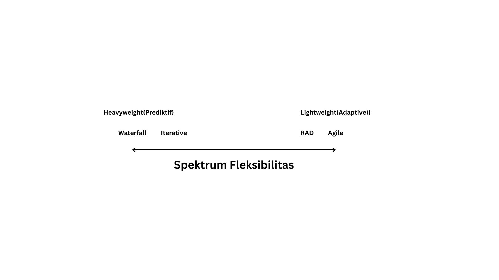
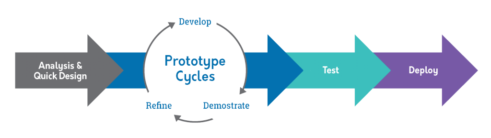

# SDLC : Rapid Application Development

Kelompok 6

Zainal / Rafli / Sylvano / Vincent / Kal-el

---

## **Apa itu Systems Development Life Cycle?**

---

SDLC adalah siklus yang digunakan dalam pembuatan atau pengembangan sistem informasi yang bertujuan untuk menyelesaikan masalah secara efektif, terstruktur dan jelas.

<!-- atau dalam kata lain SDLC adalah tahapan kerja yang bertujuan untuk menghasilkan sistem berkualitas tinggi yang sesuai dengan keinginan pelanggan atau tujuan dibuatnya sistem tersebut. -->

---

<!-- Berikut adalah siklus SDLC tradisional -->

---

<!-- SDLC Tradisional terdiri dari fase-fase siklus berikut, pertama : -->

### Planning

**"Apa masalah yang ada saat ini?"**

Tahap SDLC ini berarti mendapatkan masukan dari pihak, termasuk pelanggan, tenaga penjualan, pakar industri, dan software engineer. Pelajari kelebihan dan kelemahan sistem saat ini yang bertuju untuk meningkatkan sistem saat ini.

---

<!-- Kedua -->

### Analysis

**"Apa yang kita inginkan?"**

Pada tahap SDLC ini, tim menentukan biaya dan sumber daya yang diperlukan untuk mengimplementasikan persyaratan yang telah dianalisis. Tahap ini juga merinci resiko yang ada dan menyediakan rencana untuk mengurangi resiko tersebut.

---

<!-- Ketiga -->

### Design

**"Bagaimana kita akan mendapatkan apa yang kita inginkan?"**

Fase SDLC ini dimulai dengan mengubah spesifikasi perangkat lunak menjadi rencana desain yang disebut Spesifikasi Desain. Semua pihak kemudian meninjau rencana ini dan memberikan saran.

---

<!-- Keempat -->

### Build

**"Mari ciptakan apa yang kita inginkan."**

Pada tahap ini, development yang sebenarnya dimulai. Sangat penting bagi setiap developer untuk berpegang teguh pada rencana yang telah disepakati.

---

<!-- Kelima -->

### Testing

**"Apakah kita sudah mendapatkan apa yang kita inginkan?"**

Pada tahap ini, tim development akan menguji semua kekuranganm dan memperbaiki masalah tersebut hingga produk memenuhi spesifikasi awal.

---

### Launch

**"Mari kita mulai menggunakan apa yang kita dapatkan."**

Pada tahap ini, tujuannya adalah untuk menerapkan software akhir ke lingkungan produksi sehingga pengguna dapat mulai menggunakan produk.

---

<!-- Sekarang kita semua sudah mempunyai fondasi dasar tentang topik yang kita bahas hari ini, mari kita masuki topik utama kita hari ini, yaitu, SDLC Rapid Application Development -->

### **Metologi Rapid Application Development**

---

<!-- Walau metologi-metologi SDLC bisa di kategorisasikan dalam banyak kelompok berdasarkan criteria tersendiri, kategori paling umum yang membedakan SDLC satu dengan SDLC lainnya adalah seberapa flexiblenya sistem terhadap perubahan spesifikasi pada setiap fase -->

<!-- Dalam gambar berikut, waterfall dan agile menjadi extreme opposites satu sama lain, sesama anti tesis, kedua sistem berikut menjadi referensi untuk menentukan kategori sistem lainnya -->
---

<!-- Berikut adalah struktur siklus SDLC RAD -->

<!-- Rapid Application Development (RAD) atau Rapid Prototyping adalah model proses pembangunan perangkat lunak yang tergolong dalam teknik incremen- tal (bertingkat). RAD menekankan pada siklus pembangunan pendek, singkat, dan cepat. -->

---

### Analysis & Quick Design

Fase awal dimana semua pihak terkait mendefinisikan requirements yang dibutuhkan secara umum.

---

### Prototype

proses interaktif kontinu yang memungkinkan pengguna untuk memahami, memodifikasi, dan pada akhirnya menyetujui model kerja sistem yang memenuhi kebutuhan mereka.

Fase ini adalah siklus development utama, dimana prototype akan di kembangkan, di tunjukkan pada klien dan pada akhirnya semua saran dan pendapat yang didapat akan di terapkan pada iterasi selanjutnya.

---

### Test

Fase pengujian sistem, dan integrasi unit iterasi terakhir, mengubah prototipe dan sistem beta menjadi model kerja.

---

### Deploy

Fase terakhir dari Rapid Application Development, di mana developer mengatasi utang teknis yang timbul dalam pembuatan prototipe awal, mengoptimalkan implenmentasi untuk meningkatkan stabilitas dan maintenance saat mereka menyelesaikan produk untuk deployment.

---

## SDLC Tradisional vs RAD

---

<!-- Berikut adalah perbedaan-perbedaan metologi SDLC tradisional dengan RAD -->

| Parameter                      | RAD                             | SDLC Tradisional              |
|--------------------------------|---------------------------------|-------------------------------|
| Proses Pengembangan Aplikasi   | Inkremental dan Iteratif        | Linear dan Prediktif          |
| Struktur Team                  | Tim yang kecil dan flexible     | Tim yang besar dan kaku       |
| Produktivitas dan Flexibilitas | Tinggi karena struktur iteratif | Rendah karena struktur linear |
| Dokumentasi                    | Minimalist                      | Full Spesifikasi              |
| Waktu dan Estimasi Harga       | Variable                        | Fixed                         |
| Uji Coba                       | Extensive                       | Minimal                       |
| Interaksi Pengguna Akhir       | Setiap fase development         | Hanya awal                    |

---

### Kelebihan dan Kekurangan RAD

---

<!-- Berikut adalah beberapa kelebihan dan kekurangan metologi RAD -->

| Kelebihan                                                                                      | Kekurangan                                                      |
|------------------------------------------------------------------------------------------------|-----------------------------------------------------------------|
| Proses development menjadi lebih mudah                                                         | Membutuhkan komitmen tingkat tinggi dari semua pihak            |
| Mudah untuk diamati karena menggunakan model prototype                                         | Memerlukan sistem modular dan sulit untuk proyek berskala besar |
| Lebih fleksibel karena pengembang dapat melakukan proses desain ulang pada saat yang bersamaan | Ketelitian menjadi berkurang                                    |
| Mampu meminimalkan kesalahan-kesalahan dengan menggunakan alat-alat bantuan (CASE tools)       | Kesulitan melakukan pengukuran mengenai kemajuan proses         |

---

## Terima Kasih

<!-- Notes Akhir : 

1. contoh sdlc rad ANZ Bank (Australia and new zealand banking group limited)

 -->